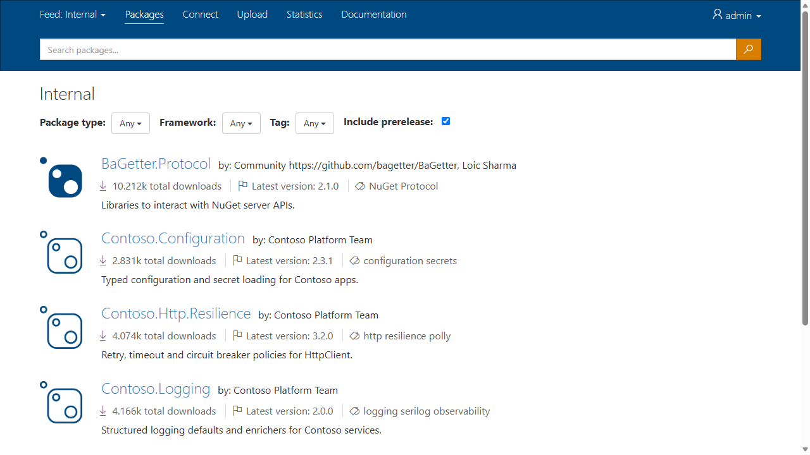

# BaGetter

BaGetter (pronounced "ba getter") is a lightweight, self-hosted **NuGet and symbol server** for .NET teams. It implements the NuGet v3 protocol, so `dotnet`, NuGet, Visual Studio and Rider work with it out of the box. It is [open source](https://github.com/letreset/BaGetter), cross-platform and cloud ready.

## About this fork

This is [letreset/BaGetter](https://github.com/letreset/BaGetter), an independently maintained fork of [bagetter/BaGetter](https://github.com/bagetter/BaGetter). It has its own releases (starting at 2.0.0) and adds:

- **[Multiple feeds](feeds.md)**: each feed has its own packages, settings, retention and read-through mirror of nuget.org or any other NuGet v3 feed.
- **[Users and permissions](authentication.md)**: local accounts, Microsoft Entra ID sign-in, groups, per-feed pull/push/delete permissions, and personal access tokens with expiry email reminders.
- **A [web UI](web-ui.md)** with per-feed search filters, package management (unlist, relist, delete) and admin pages for feeds, accounts and groups.
- **Data Protection keys in storage**, so sign-in cookies survive restarts and work across replicas.
- **HTTP hardening**: security headers, optional HSTS, configurable CORS and response compression.

Coming from upstream BaGetter 1.x? Read [Upgrading from 1.x](upgrading.md).

## Backends

| | Supported |
|---|---|
| Database | SQLite, SQL Server, PostgreSQL, MySQL |
| Package storage | File system, Azure Blob Storage, AWS S3, Google Cloud Storage, Alibaba Cloud (Aliyun) OSS, Tencent Cloud COS |
| Hosting | Docker (`linux/amd64`, `linux/arm64`), Kubernetes (Helm), Windows/IIS, any machine with the ASP.NET Core 10 runtime |

## Run BaGetter

- [Docker](Installation/docker.md)
- [Kubernetes (Helm)](Installation/kubernetes.md)
- [On your computer](Installation/local.md)
- [Azure](Installation/azure.md), [AWS](Installation/aws.md), [Google Cloud](Installation/gcp.md), [Alibaba Cloud](Installation/aliyun.md), [Tencent Cloud](Installation/tencent.md)
- [Behind Windows IIS](Installation/iis-proxy.md)

## BaGetter SDK

You can also use the [`BaGetter.Protocol`](https://www.nuget.org/packages/BaGetter.Protocol) package to interact with a NuGet server. See the [BaGetter SDK](Advanced/sdk.md) guide.
