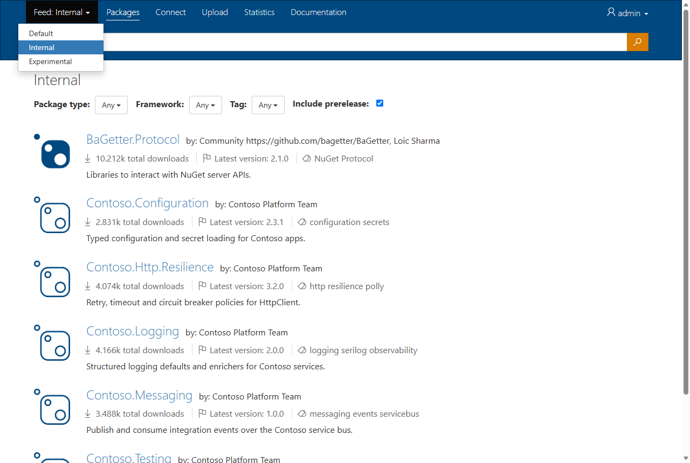
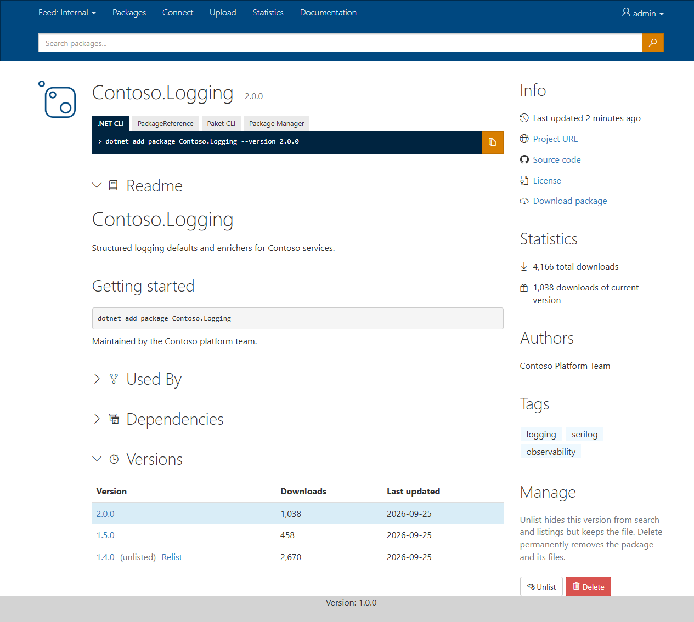
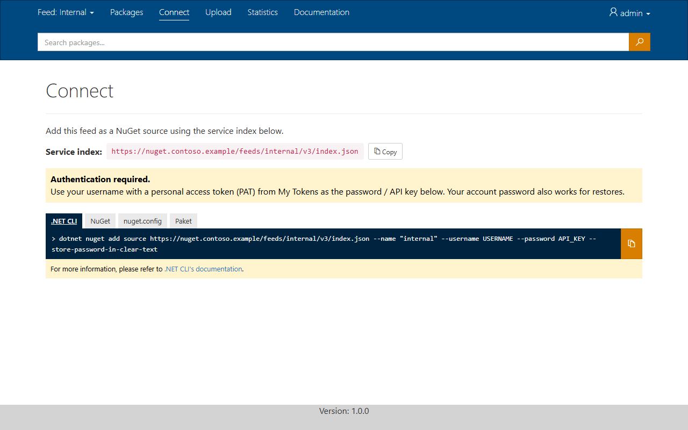
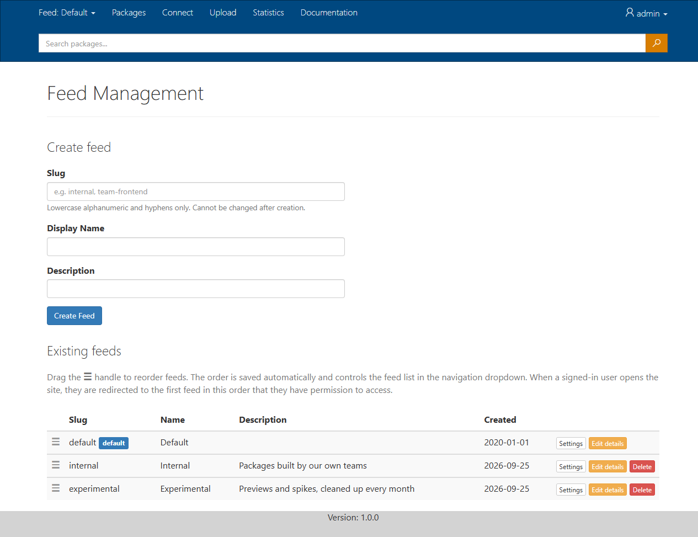
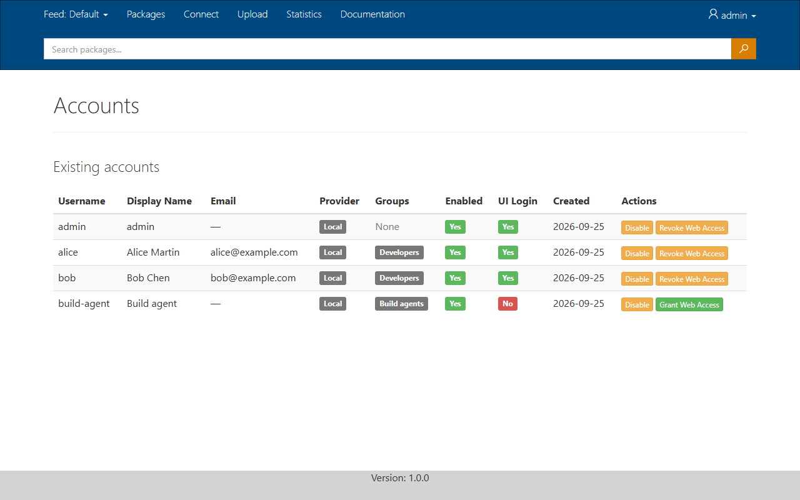
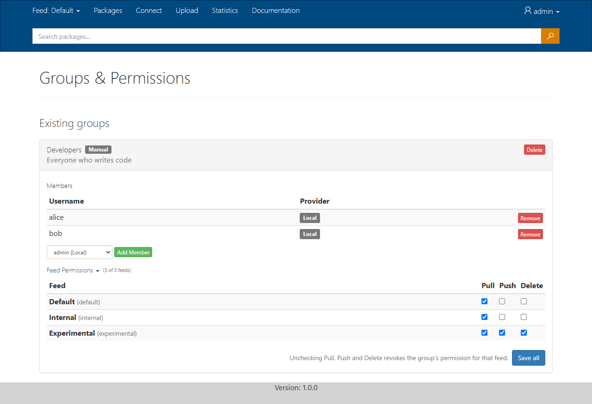

# Web UI

BaGetter has a web UI for browsing packages, connecting clients, uploading packages and managing the server. Open the server's root URL (`https://your-server/`) for the default [feed](feeds.md), or `https://your-server/feeds/{slug}/` for another feed.

What a user sees depends on their [permissions](authentication.md#feed-permissions). In the `Local`, `Entra` and `Hybrid` modes, users sign in with **Sign in** in the top bar. Feeds a user can't pull from are hidden.

## Navigation

The top bar shows these tabs for the current feed:

| Tab | Shown when | Contents |
|---|---|---|
| Feed switcher | The user can pull from more than one feed | Jumps to another feed. Feeds are listed in the order set on **Admin > Feeds** |
| Packages | Always | The package list and search |
| Connect | The user can pull from the feed | The feed's service index URL and how to authenticate |
| Upload | The user can push to the feed | Commands to publish packages |
| Statistics | The page is [enabled](configuration.md#statistics) and the user can pull from the feed | Package and version counts |

Signed-in users also get a user menu with **My Tokens**, and administrators find the **Admin** pages there.

In the `Local`, `Entra` and `Hybrid` modes, a signed-in user who opens the root URL lands on the first feed, in the order set on **Admin > Feeds**, that they can pull from. A user who opens a feed they can't pull from is sent to that feed as well.

## Search and filters

The **Packages** tab lists the feed's packages, 20 per page, with numbered pages at the bottom. Type in the search box to search the feed, and narrow the list with the filters next to it:

| Filter | Effect |
|---|---|
| Package type | Dependencies, .NET tools or .NET templates |
| Framework | Only packages that support the chosen target framework |
| Tag | Only packages with the chosen tag. Type in the dropdown to find a tag |
| Include prerelease | Show or hide prerelease versions |

The filter values come from the packages in the current feed, so each feed offers only its own frameworks and tags.

Users who can delete from the feed also see unlisted packages in the list, so they can find and relist them. Everyone else only sees listed packages, as NuGet clients do.

## Package page

A package page shows:

- The install command for the .NET CLI, `PackageReference`, Paket CLI and the Package Manager console, with a copy button.
- The readme and release notes, when the package has them.
- Dependencies grouped by target framework, and the packages in this feed that depend on it (**Used by**).
- The version history, with downloads and dates, and the total download count. On a feed with a [mirror](feeds.md#mirror-read-through-cache), versions that are only available from the mirror are marked **mirror**; they are stored in the feed the first time someone downloads them. A link to a version that doesn't exist says so instead of showing another version.
- Links to the project, source code and license, when the package provides them, and a download link for the `.nupkg`.

## Unlist, relist and delete

Users with the **Delete** permission on the feed can manage versions on the package page, in the **Manage** section:

- **Unlist** hides a version from search and listings, but keeps it. Clients that already reference that exact version can still restore it.
- **Relist** makes an unlisted version visible again. Unlisted versions are struck through in the version history, with a **Relist** link.
- **Delete** permanently removes the version and its files, whatever the feed's [deletion behavior](feeds.md#feed-settings) is. It can't be undone.

On a feed in [read-only mode](feeds.md#feed-settings) the **Manage** section and the **Relist** links are hidden, and the actions are refused. The same goes for versions that are only available from a mirror.

The feed's deletion behavior only applies to deletes from NuGet clients (`dotnet nuget delete`). Unlike those, the actions on the package page aren't written to the [audit log](configuration.md#audit-log) yet ([#39](https://github.com/letreset/BaGetter/issues/39)).

## Connect

The **Connect** tab shows the feed's service index URL with a copy button, and explains how to authenticate for the server's [authentication mode](authentication.md#authentication-modes): which user name and password or token to use, with commands for the .NET CLI, the NuGet CLI, `nuget.config` and Paket. In the `Local`, `Entra` and `Hybrid` modes, users must sign in to see it. See also [Connecting a client](feeds.md#connecting-a-client).

## Upload

The **Upload** tab shows the commands to publish a package to the current feed with the .NET CLI, the NuGet CLI, Paket and PowerShellGet. It only appears for users who can push to the feed. BaGetter doesn't accept uploads through the browser: use one of the commands.

## Statistics

The **Statistics** tab shows how many packages and versions the current feed has. When `Statistics:ListConfiguredServices` is `true` (the default), it also lists the database and storage in use. Turn the page off with `Statistics:EnableStatisticsPage`, see [Statistics](configuration.md#statistics).

## My Tokens

**My Tokens** in the user menu lists the signed-in user's [personal access tokens](authentication.md#personal-access-tokens-pats), and lets them create and revoke tokens. A new token is shown only once. The page is available to Entra and local users; administrators create tokens for local accounts without web sign-in on **Admin > Accounts**.

## Administration

Administrators get these pages under **Admin**:

| Page | Contents |
|---|---|
| Feeds | Create, edit, reorder and delete [feeds](feeds.md#managing-feeds), and open each feed's [settings](feeds.md#feed-settings) and mirrors |
| Accounts | Create, enable and disable [local accounts](authentication.md#local-accounts), allow or block web sign-in, reset passwords, create tokens, and see Entra users who have signed in. A disabled account can be deleted |
| Groups & Permissions | Manage [groups](authentication.md#groups), their members, and their [permissions](authentication.md#feed-permissions) on each feed |

### Feeds

Drag a feed by its handle to change the order. The order is saved right away, and is used by the feed switcher and to pick the feed a user lands on.

### Accounts

### Groups & Permissions

Open **Feed Permissions** under a group to set its **Pull**, **Push** and **Delete** permissions on each feed, then select **Save all**. Clearing all three removes the group's access to that feed.
